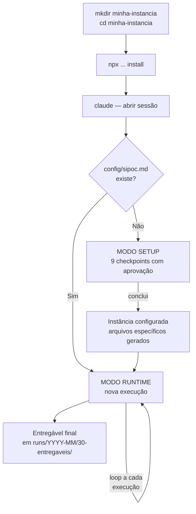
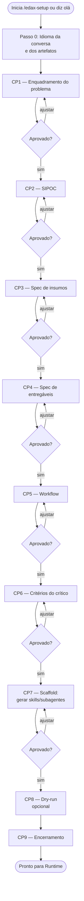
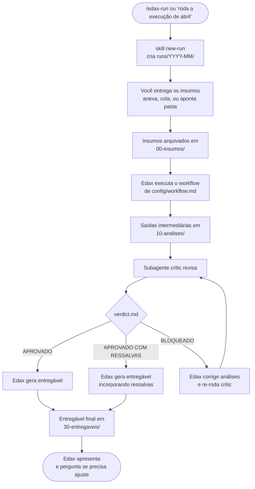

# Manual do agentic-method

Manual completo do uso do template **agentic-method** dentro do Claude Code. Para a visão executiva do projeto, veja o [README](../README.md) — este manual aprofunda cada passo, com diagramas, exemplos de diálogo e dicas práticas.

---

## Sumário

1. [Para quem é este manual](#1-para-quem-é-este-manual)
2. [Conceitos essenciais](#2-conceitos-essenciais)
3. [Pré-requisitos e instalação](#3-pré-requisitos-e-instalação)
4. [O ciclo do agentic-method (visão geral)](#4-o-ciclo-do-agentic-method-visão-geral)
5. [Setup — configurando uma nova instância](#5-setup--configurando-uma-nova-instância)
6. [Runtime — usando uma instância configurada](#6-runtime--usando-uma-instância-configurada)
7. [Slash commands](#7-slash-commands)
8. [Estrutura de pastas](#8-estrutura-de-pastas)
9. [Atualizar e compartilhar instâncias](#9-atualizar-e-compartilhar-instâncias)
10. [Walkthrough completo: análise mensal de indicadores](#10-walkthrough-completo-análise-mensal-de-indicadores)
11. [Dicas e padrões de uso](#11-dicas-e-padrões-de-uso)
12. [Solução de problemas](#12-solução-de-problemas)
13. [Glossário](#13-glossário)
14. [Referências](#14-referências)

---

## 1. Para quem é este manual

Este manual atende **três perfis**:

- **Usuário final** — alguém com uma tarefa profissional recorrente (analista, consultor, gestor) que quer transformá-la num assistente. Não precisa saber programar.
- **Operador técnico** — quem instala, atualiza e dá manutenção em instâncias. Conhecimento básico de terminal ajuda.
- **Contribuidor** — quem quer evoluir o template-mãe (mexer no `template/` do repo). Conhecimento de Markdown e do Claude Code é útil.

Se você é o **usuário final**, comece pela seção 2 e siga em ordem. As seções 11–14 são consulta de referência.

---

## 2. Conceitos essenciais

### O que o agentic-method faz

Transforma uma **tarefa que se repete** (análise mensal, revisão recorrente, geração periódica de relatório) em um **assistente especialista** que mora numa pasta. Cada vez que você abre essa pasta no Claude Code, o assistente está pronto para executar aquela tarefa.

### Os 5 conceitos que você precisa entender

| Termo | O que é |
|-------|---------|
| **Instância** | Uma pasta dedicada a **um** caso de uso. Você cria uma instância para "análise mensal de indicadores", outra para "revisão de contratos", e assim por diante. Pastas independentes. |
| **Edax** | O agente que mora na instância. Identidade completa: **Edax Maximus Andres I**. É ele quem entrevista você no Setup e executa o trabalho no Runtime. |
| **SIPOC** | Sigla do Lean Six Sigma para mapear processos: **S**uppliers (quem fornece) → **I**nputs (o que entra) → **P**rocess (o que acontece) → **O**utputs (o que sai) → **C**ustomers (quem usa). É a espinha dorsal do Setup. |
| **Setup** | Fase de **configuração** da instância. Acontece uma vez por caso de uso. Edax te entrevista e gera os arquivos específicos do seu problema. |
| **Runtime** | Fase de **execução**. Acontece toda vez que você quer rodar a tarefa configurada (mensalmente, por exemplo). |
| **Critic** | Subagente revisor que sempre revisa o trabalho do Edax antes da entrega final. Aplica critérios universais + critérios do seu domínio. |

### A grande sacada

O sistema **não te dá um assistente genérico**. No final do Setup, ele **gera** as skills e subagentes do seu caso de uso — código sob medida, não um wrapper sobre prompts vagos. É por isso que o Setup é uma entrevista profunda, não um formulário.

---

## 3. Pré-requisitos e instalação

### Pré-requisitos

- **[Claude Code](https://claude.com/claude-code)** instalado (CLI ou IDE extension).
- **Node.js ≥ 18** ([nodejs.org](https://nodejs.org)).
- **Acesso à internet** para o `npx` baixar o pacote do GitHub.

### Instalar uma instância

Abra um terminal:

```bash
mkdir indicadores-mensais          # nome da sua instância
cd indicadores-mensais
npx github:EdaxTech/agentic-method install
```

O comando copia para a pasta atual:

- `CLAUDE.md` (a identidade do Edax)
- `.claude/agents/critic.md`
- `.claude/skills/intake/`, `design-solution/`, `scaffold/`, `new-run/`
- `.claude/commands/edax-{setup,run,review}.md`
- pastas vazias `config/` e `runs/`

### Primeira sessão

```bash
claude     # ou abra a pasta no Claude Code IDE
```

Diga **"Edax, vamos começar."** ou rode `/edax-setup`. Edax se apresenta e dispara o Modo Setup.

> **Importante**: se você já tinha uma sessão Claude Code aberta nesta pasta antes do install, **feche e reabra**. Skills e CLAUDE.md só são lidos na inicialização da sessão.

### Atualizar uma instância

```bash
cd indicadores-mensais
npx github:EdaxTech/agentic-method update
```

Sobrescreve **apenas** os arquivos do template-mãe. Não toca em `config/`, `runs/`, ou nos arquivos que Edax gerou.

---

## 4. O ciclo do agentic-method (visão geral)



A primeira vez você passa pelo Setup. Da segunda em diante, é tudo Runtime.

---

## 5. Setup — configurando uma nova instância

### Princípios do Setup

- **Passo a passo, com sua aprovação a cada checkpoint.** Edax nunca avança sem você dizer "ok, próximo".
- **Você pode voltar a qualquer checkpoint anterior** se mudar de ideia.
- **Não é formulário, é entrevista.** Edax usa técnicas de elicitação (reformulação, exemplos, casos de borda) — responda no fluxo da conversa.

### Diagrama do fluxo



### Checkpoint a checkpoint

Para cada checkpoint, este manual mostra: **o que vai acontecer**, **exemplo de fala do Edax**, **o que você precisa preparar**, **onde fica gravado**.

#### Passo 0 — Idioma

- **O que vai acontecer**: Edax pergunta dois idiomas: o da conversa de Setup e o dos arquivos gerados.
- **Exemplo do Edax**: *"Em que idioma você prefere conduzir esta configuração? (PT-BR, EN, ES, ...)"*
- **Você responde**: livre. Pode dizer "PT-BR para os dois", por exemplo.
- **Grava em**: `config/language.md`.
- **Por que existe**: o template-mãe está em PT-BR, mas o Edax adapta tudo para o que você escolher. Se vai compartilhar a instância com colegas que falam outro idioma, escolha apropriadamente.

#### CP1 — Enquadramento do problema

- **O que vai acontecer**: Edax pede que você descreva o problema com suas palavras. Depois reformula e devolve uma síntese de 2–3 frases.
- **Exemplo do Edax**: *"Conta para mim, com suas palavras, qual é o problema ou tarefa recorrente que você quer transformar num assistente?"*
- **Você responde**: o problema, sem se preocupar com formato. Edax vai aprofundar com perguntas tipo: o que dispara a necessidade, como você faz hoje, o que mais dói.
- **Exemplo de resposta sua**: *"Toda primeira semana do mês recebo CSVs de 3 sistemas de venda e preciso consolidar num relatório com indicadores comparando MoM e YoY, anotações sobre anomalias, e um resumo executivo. Hoje gasto 2 dias nisso e sempre erro algum cálculo de variação."*
- **Aprovação**: Edax devolve uma síntese — você confirma ou pede para reformular.
- **Grava em**: a síntese aprovada vira a abertura de `config/sipoc.md` no CP2.

#### CP2 — SIPOC formal

- **O que vai acontecer**: Edax preenche, junto com você, uma tabela de 5 colunas (S/I/P/O/C). Construção coluna a coluna.
- **Exemplo do Edax**: *"Vamos pelo S — Suppliers. De onde vêm esses CSVs? Quem ou que sistema produz cada um?"*
- **Você responde**: descreva fornecedores reais (sistema X, sistema Y, exportação manual da equipe Z, etc.).
- **Cuidado**: aqui é alto-nível. Detalhes finos de schema vão no CP3.
- **Grava em**: `config/sipoc.md` — uma página com a tabela + síntese do problema.

#### CP3 — Spec de insumos

- **O que vai acontecer**: aprofundamento dos **I**nputs. Formato, origem, estrutura, volume, frequência, casos de borda.
- **Exemplo do Edax**: *"Você consegue colar/anexar agora um exemplo real do CSV (do mês passado, por exemplo) para eu validar o que entendi do schema?"*
- **Você responde**: idealmente, **anexe um exemplo concreto**. Sem isso, Edax pode interpretar errado.
- **Itens cobertos**:
  - Formato (CSV, planilha, PDF, texto livre, ...)
  - Origem (pasta, conversa, link, sistema)
  - Schema (colunas e tipos, ou estrutura do texto)
  - Volume típico
  - Pré-condições (já vem limpo? precisa de normalização?)
  - Casos de borda (dado faltando, formato inconsistente)
- **Grava em**: `config/inputs-spec.md`.

#### CP4 — Spec de entregáveis

- **O que vai acontecer**: define o produto final. Formato, estrutura, audiência, critérios de pronto.
- **Exemplo do Edax**: *"Imagine o entregável pronto: que seções ele tem, na ordem? Quem vai ler — equipe técnica ou diretoria?"*
- **Você responde**: descreva o relatório/dashboard/dataset esperado. Se já existe um exemplo manual da última vez, **cole/anexe** — vira referência.
- **Default**: Markdown se você não disser outra coisa.
- **Importante**: a pergunta *"como você sabe que ficou bom?"* alimenta o CP6 (critérios do crítico). Pense bem nela.
- **Grava em**: `config/deliverables-spec.md`.

#### CP5 — Desenho do workflow

- **O que vai acontecer**: Edax **propõe** um esboço de 3–7 etapas com base nos specs anteriores. Você critica e ajusta. Cada etapa recebe um nome de **executor** (skill ou subagente) que será gerado no CP7.
- **Exemplo do Edax**: *"Olhando seus insumos e o entregável, eu desenharia o fluxo assim: 1) preparar-csvs (skill), 2) calcular-indicadores (skill), 3) detectar-anomalias (subagente), 4) escrever-resumo-executivo (subagente), 5) montar-relatorio (skill). O que mudaria?"*
- **Heurística usada**: **subagente** quando precisa de contexto isolado e julgamento aberto (analisar, sintetizar). **Skill** quando é procedimento determinístico com inputs/outputs claros (validar, calcular, formatar).
- **Você responde**: critique a proposta. Adicione, remova, renomeie. Não tente desenhar do zero — reagir é mais rápido.
- **Grava em**: `config/workflow.md` (com tabela "Artefatos a gerar" no fim).

#### CP6 — Critérios do crítico

- **O que vai acontecer**: define o que o subagente `critic` vai checar **adicionalmente** aos critérios universais (que já vêm embutidos).
- **Exemplo do Edax**: *"Há regras específicas do seu domínio que toda execução deve obedecer? Coisas que, se faltarem, automaticamente reprovam o entregável?"*
- **Você responde**: regras concretas e checáveis. Exemplos:
  - "Todo indicador apresentado tem variação MoM e YoY ao lado."
  - "Dados faltantes são sinalizados, nunca silenciados."
  - "Toda seção começa com TL;DR de uma frase."
- **Critérios universais (já embutidos no critic)**: fidelidade aos dados, consistência interna, premissas explícitas, cobertura vs. spec, tratamento de faltantes, reprodutibilidade do raciocínio, calibração das afirmações, escopo respeitado.
- **Grava em**: `config/critic-criteria.md`.

#### CP7 — Scaffold

- **O que vai acontecer**: Edax gera, **arquivo a arquivo**, as skills e subagentes específicos do seu caso de uso. Pede sua aprovação para cada um.
- **Sequência**:
  1. Edax mostra a lista do que vai gerar (extraída da tabela "Artefatos a gerar" do CP5) → você aprova a lista.
  2. Para cada artefato: anuncia, gera, mostra o conteúdo, pede aprovação por arquivo. Se você pedir ajuste, edita e mostra de novo.
  3. Cada arquivo aprovado é registrado em `config/generated-manifest.md`.
- **Atenção**: este é o checkpoint que pode ser longo, mas é onde a customização real acontece. Vale a paciência.
- **Grava em**: `.claude/agents/<nome>.md`, `.claude/skills/<nome>/SKILL.md`, `config/generated-manifest.md`.

#### CP8 — Dry-run (opcional)

- **O que vai acontecer**: se você fornecer um insumo de exemplo, Edax executa o workflow inteiro contra ele e mostra o resultado.
- **Vale a pena?** Sim, sempre que possível. É a única forma de pegar problemas antes de uma execução real.
- **Grava em**: `runs/setup-dryrun/`.

#### CP9 — Encerramento

- **O que vai acontecer**: Edax confirma que tudo está pronto e te lembra que próximas chamadas (`/edax-run`) entrarão em Modo Runtime.

#### CP9.5 — Manual da solução

- **O que vai acontecer**: Edax pergunta *"Posso gerar agora o `MANUAL.md` desta solução? (recomendado)"*. Se você aprovar, ele lê todos os configs e produz um `MANUAL.md` na raiz da instância — em prosa amigável, no idioma de artefatos, escrito para o **operador** (você daqui a 6 meses, ou um colega que receber a pasta).
- **Por que existe**: o `config/` tem o conteúdo, mas em formato técnico. O `MANUAL.md` reescreve tudo para quem só quer **operar**, sem precisar entender SIPOC, skills ou critérios universais.
- **Manutenção**: sempre que você ajustar qualquer arquivo em `config/` depois disso, Edax regenera o `MANUAL.md` automaticamente. Para regenerar manualmente, use `/edax-manual`.
- **Grava em**: `MANUAL.md` na **raiz** da instância (não em `docs/`).

### Ajustes depois de fechar um checkpoint

A qualquer momento você pode dizer *"espera, no checkpoint X eu queria mudar Y"*. Edax volta, edita o arquivo correspondente, atualiza a data de aprovação, e depois retorna para onde vocês estavam. Se o `MANUAL.md` já existir, Edax o regenera automaticamente ao final do ajuste.

---

## 6. Runtime — usando uma instância configurada

### Princípios do Runtime

- **Cada execução é uma sub-pasta** versionada em `runs/`. Nada é sobrescrito — reprocessamento cria `-v2/`, `-v3/`, etc.
- **Auditoria completa**: insumos originais ficam preservados em `00-insumos/`, análises intermediárias em `10-analises/`, revisão crítica em `20-avaliacao-critica/`, entregável em `30-entregaveis/`.
- **O critic sempre revisa** antes do entregável final. Pode aprovar, aprovar com ressalvas, ou bloquear.

### Diagrama do ciclo de Runtime



### Disparando uma execução

Três formas equivalentes:

```
/edax-run 2026-04
```

```
/edax-run                 # Edax pergunta o rótulo
```

```
"Edax, vamos rodar o fechamento de abril."
```

### Entregando os insumos

Edax aceita insumos de **três jeitos**:

1. **Anexar arquivo** na conversa do Claude Code (drag-and-drop ou colar).
2. **Colar conteúdo** direto na mensagem (útil para textos curtos, prints de tabela).
3. **Apontar uma pasta**: *"Os CSVs estão em `~/downloads/abril/`."* — Edax lê de lá e copia para `00-insumos/`.

Edax sempre **arquiva o insumo original** em `00-insumos/` antes de processar — sua fonte fica preservada, mesmo se você apagar do lugar de origem.

### Reprocessar uma execução

Aconteceu algum erro nos insumos e você precisa rodar de novo o mesmo período?

```
/edax-run 2026-04
```

Edax detecta que `runs/2026-04/` já existe e cria `runs/2026-04-v2/`. Sua execução anterior fica intacta para auditoria.

### Revisão sob demanda

Editou manualmente uma análise em `10-analises/` e quer que o critic revise de novo? Use:

```
/edax-review 2026-04
```

(Sem argumento, pega a run mais recente.)

---

## 7. Slash commands

| Comando | Quando usar | Exemplo |
|---------|-------------|---------|
| `/edax-setup` | Configurar a instância (uma vez por caso de uso) ou retomar Setup parcial | `/edax-setup` |
| `/edax-run [rótulo]` | Disparar nova execução do workflow já configurado | `/edax-run 2026-04` |
| `/edax-review [run]` | Revisar de novo o critic sobre uma run específica | `/edax-review 2026-04` |
| `/edax-manual` | Regenerar o `MANUAL.md` da instância a partir do estado atual de `config/` | `/edax-manual` |

Sem comandos, você também pode falar com o Edax em linguagem natural — ele entende intenção. Os comandos são atalhos.

---

## 8. Estrutura de pastas

```
minha-instancia/
├── CLAUDE.md                         ← template — identidade do Edax (system prompt)
├── MANUAL.md                         ← gerado por Edax no CP9.5 — manual de operação da solução
├── .claude/
│   ├── agents/
│   │   ├── critic.md                 ← template (subagente, invocado em Runtime)
│   │   └── <gerados>.md              ← criados pelo Edax no CP7
│   ├── skills/
│   │   ├── intake/                   ← template
│   │   ├── design-solution/          ← template
│   │   ├── scaffold/                 ← template
│   │   ├── new-run/                  ← template
│   │   ├── write-manual/             ← template
│   │   └── <gerados>/                ← criados pelo Edax no CP7
│   └── commands/
│       ├── edax-setup.md             ← template
│       ├── edax-run.md               ← template
│       ├── edax-review.md            ← template
│       └── edax-manual.md            ← template
├── config/                           ← preenchido no Setup
│   ├── language.md
│   ├── sipoc.md
│   ├── inputs-spec.md
│   ├── deliverables-spec.md
│   ├── workflow.md
│   ├── critic-criteria.md
│   └── generated-manifest.md
└── runs/                             ← uma sub-pasta por execução
    └── YYYY-MM[-vN]/
        ├── _run.md                   ← metadados e status da run
        ├── 00-insumos/
        ├── 10-analises/
        ├── 20-avaliacao-critica/
        │   ├── verdict.md
        │   └── findings.md
        └── 30-entregaveis/
```

### O que **mexer** e o que **não mexer**

- **Não mexa** em arquivos do template (`CLAUDE.md`, `critic.md`, `intake/`, `design-solution/`, `scaffold/`, `new-run/`, `write-manual/`, `edax-*.md`). Eles se atualizam por `npx ... update`. Se você editar e depois rodar `update`, sua edição é sobrescrita.
- **Pode mexer** em arquivos gerados (`config/*`, `.claude/agents/<gerados>.md`, `.claude/skills/<gerados>/`). Edição manual sua é preservada — `update` não toca aí.
- **Pode mexer** em `MANUAL.md`, mas atenção: ele é regenerado automaticamente quando você ajusta `config/`, ou manualmente com `/edax-manual`. Customizações suas serão sobrescritas. Se quer customização permanente, faça via ajuste em `config/` (e o manual regenerado já vai refletir).
- **Pode mexer** em `runs/*` se precisar corrigir um insumo manualmente, mas considere reprocessar (`-v2`) em vez de editar a run original — preserva auditoria.

---

## 9. Atualizar e compartilhar instâncias

### Atualizar para a versão mais recente do template

```bash
cd minha-instancia
npx github:EdaxTech/agentic-method update
```

Sobrescreve **só** os arquivos do template. Não toca em `config/`, `runs/`, ou nos seus arquivos gerados.

> **Quando atualizar?** Quando você (ou alguém da equipe) souber que saiu uma melhoria no template-mãe. Releases importantes serão anunciados nas [releases do repo](https://github.com/EdaxTech/agentic-method/releases).

### Compartilhar uma instância pronta com um colega

Sim, é possível, e a instância é **autocontida** — não precisa de instalação separada na máquina do colega.

```bash
zip -r minha-instancia.zip minha-instancia/
# enviar para o colega
```

O colega:
1. Descompacta.
2. Abre o Claude Code na pasta.
3. Pode imediatamente rodar `/edax-run` (ou `/edax-setup` se quiser reconfigurar).

> **Cuidado com runs/**: se você incluir `runs/` no zip, mandará junto os insumos e entregáveis das execuções anteriores. Se houver dado sensível, exclua antes (`rm -rf runs/`) ou compartilhe seletivamente.

### Versionar instância em Git

Recomendado para casos de uso de equipe. Sugestão de `.gitignore`:

```
# Insumos podem conter dado sensível
runs/*/00-insumos/

# Logs/temporários
*.log
```

Mantenha versionados: `CLAUDE.md`, `.claude/`, `config/`, e a estrutura de `runs/` (mas não os insumos).

---

## 10. Walkthrough completo: análise mensal de indicadores

Cenário ilustrativo. Detalhes serão diferentes no seu caso real.

### Passo 1: instalar

```bash
mkdir indicadores-mensais
cd indicadores-mensais
npx github:EdaxTech/agentic-method install
claude
```

### Passo 2: Setup (resumido)

Você diz: *"Edax, vamos começar."*

> **Edax**: Olá, sou Edax Maximus Andres I — pode me chamar de Edax. Detectei que esta pasta ainda não foi configurada (modo Setup). Antes de tudo: em que idioma vamos trabalhar?

Você: *"PT-BR para conversa e artefatos."*

> **Edax**: Anotado. **CP1 — Enquadramento.** Conta para mim com suas palavras: qual é o problema ou tarefa recorrente?

Você: *"Toda primeira semana do mês recebo CSVs de 3 sistemas de venda. Preciso consolidar, calcular indicadores comparando com o mês anterior e mesmo mês do ano passado, sinalizar anomalias e gerar um relatório executivo em Markdown."*

> **Edax**: Entendi. Pra confirmar: você quer um assistente que, dado um conjunto de CSVs do mês corrente, produza um relatório consolidado com indicadores, comparações MoM/YoY, e flags de anomalia. É isso?

Você: *"Exato."*

> **Edax**: Posso seguir para o SIPOC?

[... vocês passam por CP2-CP4 conversando, com Edax pedindo exemplos concretos dos CSVs ...]

> **Edax**: **CP5 — Workflow.** Olhando o que você descreveu, eu desenharia 5 etapas:
> 1. `preparar-csvs` (skill) — valida schema, normaliza datas, junta os 3 sistemas em um dataset
> 2. `calcular-indicadores` (skill) — computa MoM, YoY, totais, rankings
> 3. `detectar-anomalias` (subagente) — análise interpretativa de outliers
> 4. `escrever-resumo-executivo` (subagente) — síntese narrativa do mês
> 5. `montar-relatorio` (skill) — empacota tudo em Markdown final
>
> O que mudaria?

Você: *"Adiciona uma etapa antes da 1 chamada `validar-completude` — quero garantir que os 3 sistemas mandaram dados."*

> **Edax**: Boa, faz sentido. Atualizando para 6 etapas... [mostra workflow.md ajustado] ...posso seguir para os critérios do crítico?

[... CP6 e CP7 ...]

### Passo 3: primeira execução real

Mês seguinte, você abre a pasta:

```bash
cd indicadores-mensais
claude
```

Você: */edax-run 2026-04*

> **Edax**: Criando `runs/2026-04/`. Pode me passar os insumos?

Você anexa 3 CSVs.

> **Edax**: Recebi. Arquivados em `00-insumos/`. Iniciando workflow:
>
> ✓ `validar-completude` — 3 de 3 sistemas presentes
> ✓ `preparar-csvs` — 12.453 linhas consolidadas
> ✓ `calcular-indicadores` — 18 indicadores computados (saída em `10-analises/03-indicadores.md`)
> ✓ `detectar-anomalias` — 2 anomalias sinalizadas (saída em `10-analises/04-anomalias.md`)
> ✓ `escrever-resumo-executivo` — saída em `10-analises/05-resumo.md`
>
> Invocando critic para revisão...

[... critic produz `verdict.md: APROVADO COM RESSALVAS` (1 achado menor sobre uma fórmula de YoY) ...]

> **Edax**: Critic aprovou com 1 ressalva menor (cálculo de YoY de uma categoria nova). Incorporei a ressalva no relatório final como nota de rodapé. Entregável pronto em `runs/2026-04/30-entregaveis/relatorio-abril-2026.md`.
>
> Quer que eu abra para você revisar, ou tem algum ajuste?

### Passo 4: maio (e em diante)

Da segunda execução em diante, é só repetir `/edax-run 2026-05`. A instância já sabe tudo.

---

## 11. Dicas e padrões de uso

### No Setup

- **Tenha um exemplo de insumo real à mão** antes de começar. Sem exemplo, o CP3 vira adivinhação.
- **Tenha um exemplo de entregável atual** (mesmo que feito à mão). Vira referência poderosa para o CP4.
- **Invista no CP6 (critérios do crítico)**. Quanto mais específico você for, mais valor o critic agrega depois.
- **Não atalhe o CP7**. Veja cada arquivo gerado com calma. Pequenos ajustes aqui economizam horas depois.
- **Faça o dry-run (CP8)**. Sempre. É a única forma de pegar problemas antes do primeiro mês real.

### Skill ou subagente?

| Use **subagente** se... | Use **skill** se... |
|---|---|
| Tarefa precisa de julgamento aberto (analisar, sintetizar, escrever) | Tarefa é determinística (validar, calcular, formatar) |
| Envolve idas e vindas, lê e produz vários arquivos | Roda em um pulso, devolve um artefato |
| Pode rodar em paralelo com outras etapas | É linear no fluxo |
| Vale ter contexto isolado | Cabe no contexto principal |

Em dúvida, **comece com skill**. Subagentes têm custo de contexto — só vale quando o ganho de isolamento compensa.

### Nomenclatura recomendada

- **Skills**: verbo no infinitivo, kebab-case curto. Ex.: `preparar-csvs`, `calcular-indicadores`, `montar-relatorio`.
- **Subagentes**: substantivo de papel. Ex.: `analista`, `editor`, `auditor`.
- **Pastas de saída**: `10-analises/<n>-<nome-da-etapa>/` — o prefixo numérico mantém ordem cronológica.

### Aproveitando o critic ao máximo

- **Critérios checáveis** valem mais que critérios subjetivos. *"Deve ter MoM e YoY"* > *"Deve ser claro"*.
- **Severidade binária**: o critic distingue **crítica** (bloqueia) e **menor** (vira ressalva). Não tente granular mais.
- Use `/edax-review` quando editou manualmente uma análise — força nova revisão.

### Reprocessamento

- Insumo veio errado e você corrigiu? Rode `/edax-run YYYY-MM` de novo. Edax cria `-v2/` automaticamente.
- Quer comparar duas versões? Os arquivos estão lado a lado em `runs/`.

---

## 12. Solução de problemas

### "Edax não aparece" — após install, ele não responde

- **Causa mais provável**: a sessão do Claude Code já estava aberta antes do install. CLAUDE.md e skills só são carregados na inicialização.
- **Solução**: feche e reabra a sessão na pasta da instância.

### "Comando npx falhou: package not found"

- **Causa**: você usou `npx @edaxtech/agentic-method install` (sem `github:`). O pacote não está no npm registry, só no GitHub.
- **Solução**: use `npx github:EdaxTech/agentic-method install`.

### "Critic está sempre bloqueando, mesmo quando o resultado parece bom"

- Provável: critérios em `config/critic-criteria.md` muito estritos ou mal calibrados.
- Olhe `runs/<run>/20-avaliacao-critica/findings.md` para entender **o quê** o critic está pegando. Se o achado é justo, o problema é a análise; se é exagero, ajuste o critério.

### "Quero resetar o Setup e começar de novo"

```bash
rm config/sipoc.md      # ou rm -rf config/ se quiser tudo
```

Edax volta para Modo Setup na próxima sessão. Mantenha `config/language.md` se quiser pular o Passo 0.

### "Apaguei sem querer um arquivo do template"

```bash
npx github:EdaxTech/agentic-method update
```

Restaura todos os arquivos do template à versão mais recente.

### "Quero ver o que o Edax gerou no Setup"

```bash
cat config/generated-manifest.md
```

Lista de tudo que foi criado, com data, caminho e propósito.

### "Skill gerada não funciona como esperado"

Edição direta é OK — esses arquivos pertencem a você. Abra `.claude/skills/<nome>/SKILL.md` e ajuste. Atualize a coluna "Última edição" no `generated-manifest.md`.

### "Quero migrar de uma instância antiga para o template novo"

```bash
cd instancia-antiga
npx github:EdaxTech/agentic-method update
```

Os arquivos do template são atualizados; seus arquivos gerados e configs são preservados. Teste a próxima execução para garantir compatibilidade.

---

## 13. Glossário

| Termo | Significado |
|-------|-------------|
| **Agentic-method** | Este template/projeto. |
| **Artefato** | Qualquer arquivo gerado: skill, subagente, config. |
| **Checkpoint** | Cada uma das 9 etapas do Setup, com aprovação explícita. |
| **CP** | Abreviação de "checkpoint" usada nos diagramas. |
| **Critic** | Subagente revisor adversarial. Aplica critérios universais + de domínio. |
| **CWD** | Current Working Directory — a pasta atual onde o terminal/Claude está. |
| **Dry-run** | Execução de teste no Setup, com insumo de exemplo, antes da primeira execução real. |
| **Edax** | O agente orquestrador. Identidade completa: Edax Maximus Andres I. |
| **Findings** | Lista detalhada de achados produzida pelo critic, em `findings.md`. |
| **Frontmatter** | Bloco `---` no topo de arquivos `.md` com metadados YAML (`name`, `description`). |
| **Instância** | Uma pasta dedicada a um caso de uso. |
| **Manifest** | `config/generated-manifest.md`, listando tudo que foi criado pelo scaffold. |
| **MANUAL.md (instância)** | Documento na raiz da instância, gerado no CP9.5 pela skill `write-manual`. Manual operacional do caso de uso, escrito para o operador (não o desenvolvedor do template). Regenerado automaticamente quando algo em `config/` muda. |
| **Modo Setup** | Fase de configuração de uma instância nova. |
| **Modo Runtime** | Fase de execução em instância já configurada. |
| **Run** | Uma execução do workflow. Cada run é uma sub-pasta em `runs/`. |
| **Scaffold** | CP7 do Setup: geração dos arquivos `.md` específicos do caso de uso. |
| **SIPOC** | Suppliers, Inputs, Process, Outputs, Customers — o modelo para o CP2. |
| **Skill** | Arquivo de instruções carregado sob demanda pelo Edax. Determinística. |
| **Slash command** | Atalho que começa com `/` (ex.: `/edax-setup`). |
| **Subagente** | Agente isolado, invocado para tarefas one-shot. Critic é um. |
| **Template-mãe** | Os arquivos imutáveis copiados pelo `install` — aqueles que se atualizam por `update`. |
| **Verdict** | Veredicto do critic em `verdict.md`: APROVADO, APROVADO COM RESSALVAS ou BLOQUEADO. |
| **Workflow** | Sequência de etapas definida em `config/workflow.md`, executada no Runtime. |

---

## 14. Referências

- **Repositório**: https://github.com/EdaxTech/agentic-method
- **Reportar bug ou propor melhoria**: [Issues](https://github.com/EdaxTech/agentic-method/issues)
- **Releases**: https://github.com/EdaxTech/agentic-method/releases
- **Claude Code (oficial)**: https://claude.com/claude-code
- **Claude Code — docs sobre subagentes, skills e slash commands**: https://docs.claude.com/en/docs/claude-code
- **Conceito de SIPOC (Wikipedia, EN)**: https://en.wikipedia.org/wiki/SIPOC
- **Node.js (download)**: https://nodejs.org

---

_Manual mantido junto com o template-mãe. Edições aqui podem (e devem) ser submetidas por PR no repositório._
